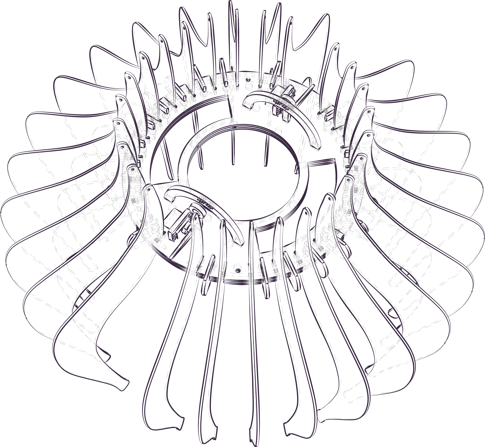
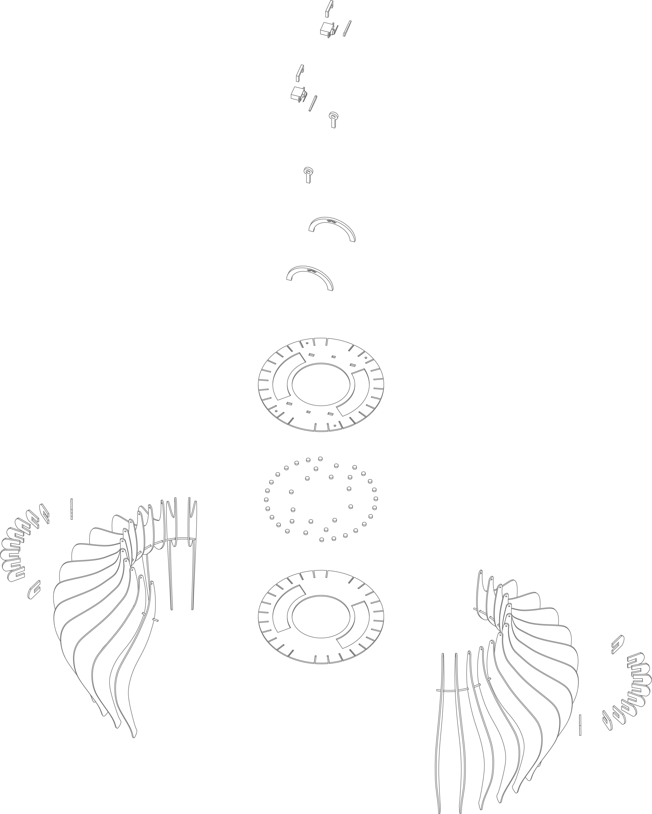

# **Breathing Lamp**

## **Overview**
The Breathing Lamp is a chandelier designed as part of a university design exercise to replicate the structure and motion of a rib cage during breathing. It uses servo motors and an Arduino to create a dynamic, kinetic effect.

## **Technical Details**
- **Microcontroller**: Arduino.
- **Motion Control**: Operated by a servo motor to mimic the expansion and contraction of ribs.
- **Materials**: Lightweight, durable materials for the ribs, anchored to a central circular spine.
- **Code**: The Arduino code controls the servo motor for smooth, rhythmic motion.

## **Features**
- **Kinetic Design**: Mimics the natural breathing process by expanding and contracting the structure.
- **Dynamic Movement**: Controlled by a servo motor and Arduino, creating a rhythmic motion.
- **Modular Construction**: Easy to assemble and modify.

## **Usage**
This project demonstrates the integration of motion in design and is a blend of technical functionality and aesthetic exploration.
